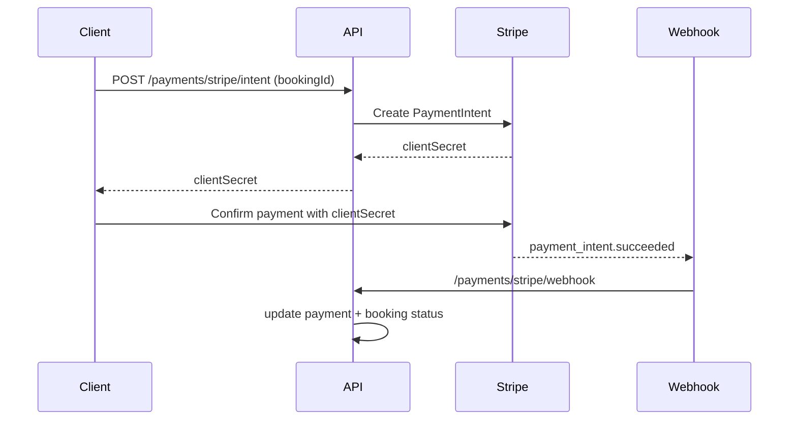
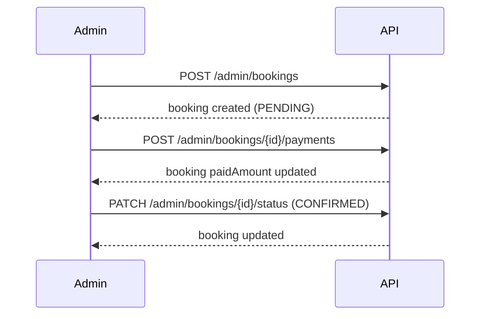
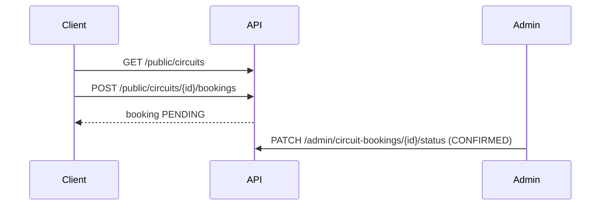
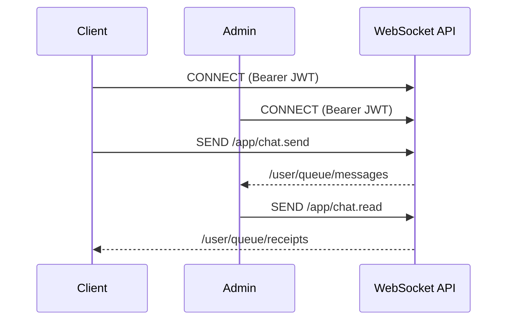

# 🚗 Car Joy Platform API — Full Documentation & Workflows

This document is the complete guide for this Spring Boot API: setup, architecture, workflows, and **all endpoints** grouped by feature. It is based on the current source in this repo.

---

## 📌 Overview

**Tech stack**
- Java 17, Spring Boot 3.5.4
- MongoDB (primary DB)
- Redis (cache)
- JWT auth (RSA keys)
- Cloudinary (uploads)
- Stripe (payments)
- WebSocket/STOMP (real‑time chat)

**Main domains**
- Auth + OTP
- Users
- Vehicles + Locations
- Bookings + Payments (manual + Stripe)
- Promotions
- Reviews
- Excursions + Excursion Bookings
- Circuits + Circuit Bookings
- Real‑time Chat
- Admin analytics

---

## 🧭 Base URLs & Security

**Base API prefix**: `/api/v1`

**Public (no auth)**
- `/api/v1/auth/**`
- `/api/v1/public/**`
- `/api/v1/otp/**`
- `/api/v1/payments/stripe/webhook`
- `/ws/**` (WebSocket endpoint)

**Auth**
- JWT Bearer token required for protected endpoints
- Admin endpoints require role `ADMIN`

**JWT**
- Access + refresh tokens signed with RSA keys in `src/main/resources/keys/local-only/`

---

## 🔧 Setup & Configuration

**Required env**
- MongoDB, Redis, Cloudinary, Mail
- Stripe (optional but enabled)

See `.env.example` for all variables. Key Stripe vars:
- `STRIPE_SECRET_KEY`
- `STRIPE_WEBHOOK_SECRET`

**application.yml**
- Includes fallback Stripe keys for local dev (replace in production).

---

## 🧱 Error Responses

Error body format:
```json
{
  "code": "ERR_CODE",
  "message": "Human‑readable message",
  "validationErrors": [
    { "field": "fieldName", "code": "ERR_CODE", "message": "..." }
  ]
}
```

---

## ✅ Authentication & OTP Flows

### 🧑‍💼 Auth API
- `POST /api/v1/auth/login`
- `POST /api/v1/auth/register`
- `POST /api/v1/auth/refresh`

### 🔐 OTP API
- `POST /api/v1/otp/generate`
- `POST /api/v1/otp/verify`
- `POST /api/v1/otp/resend`

**Use cases**
- Email verification, password reset, etc. (depends on `OtpPurpose` enum)

---

## 👤 User Profile

- `PATCH /api/v1/users/me` — update profile
- `POST /api/v1/users/me/password` — change password
- `PATCH /api/v1/users/me/deactivate`
- `PATCH /api/v1/users/me/reactivate`
- `DELETE /api/v1/users/me`

---

## 🚘 Vehicles

**Public**
- `GET /api/v1/public/vehicles` (filters: location, dates, category, transmission, fuel, seats, price)
- `GET /api/v1/public/vehicles/{id}`

**Admin**
- `GET /api/v1/admin/vehicles`
- `GET /api/v1/admin/vehicles/{id}`
- `POST /api/v1/admin/vehicles`
- `PUT /api/v1/admin/vehicles/{id}`
- `DELETE /api/v1/admin/vehicles/{id}`

---

## 📍 Locations

**Public**
- `GET /api/v1/public/locations`

**Admin**
- `GET /api/v1/admin/locations`
- `GET /api/v1/admin/locations/{id}`
- `POST /api/v1/admin/locations`
- `PUT /api/v1/admin/locations/{id}`
- `DELETE /api/v1/admin/locations/{id}`

---

## 📅 Bookings (Car Rentals)

**Customer**
- `POST /api/v1/bookings`
- `GET /api/v1/bookings`
- `GET /api/v1/bookings/{id}`
- `POST /api/v1/bookings/{id}/cancel`

**Admin**
- `GET /api/v1/admin/bookings`  
  Filters: `query`, `status`, `paymentStatus`, `startDate`, `endDate`
- `POST /api/v1/admin/bookings` — manual booking
- `POST /api/v1/admin/bookings/{id}/payments` — manual payment
- `GET /api/v1/admin/bookings/stats`
- `GET /api/v1/admin/bookings/export` — CSV
- `PATCH /api/v1/admin/bookings/{id}/status`

**Booking workflow**
1) Customer creates booking → status `PENDING`
2) Admin can confirm/activate/complete/cancel
3) Manual payment updates paid amount + payment history
4) Stripe payments update booking via webhook

---

## 💳 Payments

**Customer**
- `POST /api/v1/payments` — create payment record
- `GET /api/v1/payments`
- `GET /api/v1/payments/{id}`

**Admin**
- `GET /api/v1/admin/payments`
- `PATCH /api/v1/admin/payments/{id}/status`

### 💳 Stripe Flow
- `POST /api/v1/payments/stripe/intent`
- `POST /api/v1/payments/stripe/confirm`
- `POST /api/v1/payments/stripe/webhook`

**Stripe workflow**
1) Create PaymentIntent → receive `clientSecret`
2) Client confirms with Stripe → call `/confirm`
3) Stripe calls webhook → payment status updated (PAID/FAILED/REFUNDED)

---

## 🎟️ Promotions

**Public**
- `GET /api/v1/public/promotions/validate?code=CODE&amount=123`

**Admin**
- `GET /api/v1/admin/promotions`
- `GET /api/v1/admin/promotions/{id}`
- `POST /api/v1/admin/promotions`
- `PUT /api/v1/admin/promotions/{id}`
- `DELETE /api/v1/admin/promotions/{id}`

---

## ⭐ Reviews

**Public**
- `GET /api/v1/public/reviews?vehicleId=...`

**Customer**
- `POST /api/v1/reviews`

**Admin**
- `GET /api/v1/admin/reviews`
- `PATCH /api/v1/admin/reviews/{id}/status`

Statuses: `PENDING`, `APPROVED`, `REJECTED`

---

## 🧭 Excursions

**Public**
- `GET /api/v1/public/excursions`
- `GET /api/v1/public/excursions/{id}`

**Admin**
- `GET /api/v1/admin/excursions`
- `GET /api/v1/admin/excursions/{id}`
- `POST /api/v1/admin/excursions`
- `PUT /api/v1/admin/excursions/{id}`
- `PATCH /api/v1/admin/excursions/{id}/enabled?enabled=true|false`
- `DELETE /api/v1/admin/excursions/{id}`

---

## 🧾 Excursion Bookings

**Public**
- `POST /api/v1/public/excursions/{excursionId}/bookings`

**Customer**
- `GET /api/v1/excursions/bookings`
- `GET /api/v1/excursions/bookings/{id}`
- `POST /api/v1/excursions/bookings/{id}/cancel`
- `GET /api/v1/excursions/bookings/{id}/ticket`

**Admin**
- `GET /api/v1/admin/excursion-bookings`
- `GET /api/v1/admin/excursion-bookings/{id}`
- `PUT /api/v1/admin/excursion-bookings/{id}/status`
- `GET /api/v1/admin/excursion-bookings/export`
- `POST /api/v1/admin/excursion-bookings/{id}/send-confirmation`

---

## 🚍 Circuits (City‑to‑City Transfers)

**Public**
- `GET /api/v1/public/circuits`
- `GET /api/v1/public/circuits/{id}`
- `POST /api/v1/public/circuits/{id}/bookings`

**Admin**
- `GET /api/v1/admin/circuits`
- `GET /api/v1/admin/circuits/stats`
- `POST /api/v1/admin/circuits`
- `PUT /api/v1/admin/circuits/{id}`
- `DELETE /api/v1/admin/circuits/{id}`

---

## 🧾 Circuit Bookings

**Customer Dashboard**
- `GET /api/v1/circuits/bookings?status=...`
- `GET /api/v1/circuits/bookings/{id}`
- `POST /api/v1/circuits/bookings/{id}/cancel`
- `GET /api/v1/circuits/bookings/{id}/ticket`

**Admin**
- `GET /api/v1/admin/circuit-bookings`
- `GET /api/v1/admin/circuit-bookings/{id}`
- `GET /api/v1/admin/circuit-bookings/stats`
- `PATCH /api/v1/admin/circuit-bookings/{id}/status`

**Status workflow**
- `PENDING → CONFIRMED or CANCELLED`
- `CONFIRMED → COMPLETED`

---

## 💬 Real‑Time Chat

**REST**
- `POST /api/v1/chat/conversations`
- `GET /api/v1/chat/conversations`
- `GET /api/v1/chat/conversations/{id}/messages`
- `POST /api/v1/chat/messages`
- `PATCH /api/v1/chat/messages/{id}`
- `DELETE /api/v1/chat/messages/{id}`
- `POST /api/v1/chat/conversations/{id}/read`
- `POST /api/v1/chat/conversations/{id}/delivered`

**WebSocket**
- Endpoint: `/ws`
- App destinations:  
  - `/app/chat.send`
  - `/app/chat.typing`
  - `/app/chat.read`
  - `/app/chat.delivered`
- Subscriptions:  
  - `/user/queue/messages`
  - `/user/queue/typing`
  - `/user/queue/receipts`
  - `/topic/presence`

**Features**
✅ Typing, receipts (sent/delivered/read), delete/edit, presence, attachments

---

## 📤 Uploads

- `POST /api/v1/uploads/images`
- `POST /api/v1/uploads/documents`

Cloudinary metadata is returned in responses.

---

## 📊 Admin Analytics

- `GET /api/v1/admin/analytics/overview`

---

## ✅ Common Workflows (Use Cases)

### 1) Customer booking + payment
1) Browse vehicles → `/public/vehicles`
2) Create booking → `/bookings`
3) Pay via Stripe → `/payments/stripe/intent` then `/confirm`
4) Booking status updated by webhook

### 2) Admin manual booking
1) Create booking → `/admin/bookings`
2) Record partial payments → `/admin/bookings/{id}/payments`
3) Update status → `/admin/bookings/{id}/status`

### 3) Circuit booking (public)
1) Browse circuits → `/public/circuits`
2) Book circuit → `/public/circuits/{id}/bookings`
3) Customer sees in dashboard → `/circuits/bookings`

### 4) Excursion booking (public)
1) Browse excursions → `/public/excursions`
2) Book excursion → `/public/excursions/{id}/bookings`
3) Download ticket → `/excursions/bookings/{id}/ticket`

### 5) Reviews
1) Customer submits review → `/reviews`
2) Admin approves → `/admin/reviews/{id}/status`
3) Public lists approved reviews → `/public/reviews`

### 6) Chat support
1) Client starts conversation → `/chat/conversations`
2) Messages via REST or WebSocket
3) Admin replies in real‑time

---

## 🧪 Health / Debug Tips

- Use Swagger UI: `/swagger-ui.html`
- Inspect JWT contents to verify roles
- Check MongoDB collections:
  - `users`, `vehicles`, `bookings`, `payments`
  - `excursions`, `excursion_bookings`
  - `circuits`, `circuit_bookings`
  - `conversations`, `chat_messages`

---

## ✅ Glossary (Key Statuses)

**BookingStatus**: `PENDING`, `CONFIRMED`, `ACTIVE`, `COMPLETED`, `CANCELED`  
**BookingPaymentStatus**: `UNPAID`, `PARTIAL`, `PAID`, `REFUNDED`  
**ExcursionBookingStatus**: `PENDING`, `CONFIRMED`, `CANCELLED`, `COMPLETED`  
**CircuitBookingStatus**: `PENDING`, `CONFIRMED`, `CANCELLED`, `COMPLETED`  
**ReviewStatus**: `PENDING`, `APPROVED`, `REJECTED`

---

## 📣 Notes

- Stripe keys are **placeholder defaults**; override with env vars in production.
- Webhook endpoint is public and validates Stripe signatures.
- CSV export endpoints return `text/csv`.


---

## 🧾 Endpoint Examples (Requests / Responses)

> All examples are minimal and trimmed for clarity.

### 🔐 Auth
**POST /api/v1/auth/login**
```json
{
  "email": "john@example.com",
  "password": "pAssword1!_"
}
```
```json
{
  "access_token": "jwt-access",
  "refresh_token": "jwt-refresh",
  "token_type": "Bearer"
}
```

**POST /api/v1/auth/register**
```json
{
  "firstName": "John",
  "lastName": "Smith",
  "email": "john@example.com",
  "phoneNumber": "+15551234567",
  "password": "pAssword1!_",
  "confirmPassword": "pAssword1!_"
}
```
Response: `201 Created` (empty body)

**POST /api/v1/auth/refresh**
```json
{
  "refreshToken": "jwt-refresh"
}
```
```json
{
  "access_token": "jwt-access",
  "refresh_token": "jwt-refresh",
  "token_type": "Bearer"
}
```

### 🔐 OTP
**POST /api/v1/otp/generate**
```json
{
  "userId": "user123",
  "purpose": "EMAIL_VERIFICATION"
}
```
```json
{ "message": "OTP sent successfully to your registered email", "expiresInMinutes": 10 }
```

**POST /api/v1/otp/verify**
```json
{
  "userId": "user123",
  "otpCode": "123456",
  "purpose": "EMAIL_VERIFICATION"
}
```
```json
{ "valid": true, "message": "OTP verified successfully" }
```

**POST /api/v1/otp/resend**
```json
{
  "userId": "user123",
  "purpose": "EMAIL_VERIFICATION"
}
```
```json
{ "message": "New OTP sent successfully to your registered email", "expiresInMinutes": 10 }
```

### 👤 User
**PATCH /api/v1/users/me**
```json
{
  "firstName": "John",
  "lastName": "Smith",
  "dateOfBirth": "1995-05-20"
}
```
Response: `204 No Content`

**POST /api/v1/users/me/password**
```json
{
  "currentPassword": "OldPass1!",
  "newPassword": "NewPass1!",
  "confirmNewPassword": "NewPass1!"
}
```
Response: `204 No Content`

**PATCH /api/v1/users/me/deactivate** — Response `204 No Content`  
**PATCH /api/v1/users/me/reactivate** — Response `204 No Content`  
**DELETE /api/v1/users/me** — Response `204 No Content`

---

### 🚘 Vehicles
**GET /api/v1/public/vehicles?locationId=LOC1&startDate=2025-01-10&endDate=2025-01-12**
```json
{
  "content": [
    {
      "id": "veh1",
      "make": "Mercedes-Benz",
      "model": "S-Class",
      "dailyRate": 299,
      "status": "ACTIVE"
    }
  ],
  "totalElements": 1
}
```

**GET /api/v1/public/vehicles/{id}**
```json
{ "id": "veh1", "make": "Mercedes-Benz", "model": "S-Class", "dailyRate": 299 }
```

**POST /api/v1/admin/vehicles**
```json
{
  "make": "BMW",
  "model": "X5",
  "year": 2022,
  "category": "SUV",
  "dailyRate": 150,
  "locationId": "LOC1",
  "status": "ACTIVE"
}
```
```json
{ "id": "veh2", "make": "BMW", "model": "X5", "dailyRate": 150 }
```

**PUT /api/v1/admin/vehicles/{id}** — request body same shape as create  
**DELETE /api/v1/admin/vehicles/{id}** — Response `204 No Content`

---

### 📍 Locations
**GET /api/v1/public/locations**
```json
[
  { "id": "loc1", "name": "Airport", "city": "Tunis", "active": true }
]
```

**POST /api/v1/admin/locations**
```json
{
  "name": "Downtown",
  "code": "DTN",
  "city": "Tunis",
  "country": "TN",
  "active": true
}
```
```json
{ "id": "loc2", "name": "Downtown", "code": "DTN", "active": true }
```

**PUT /api/v1/admin/locations/{id}** — request body same shape as create  
**DELETE /api/v1/admin/locations/{id}** — Response `204 No Content`

---

### 📅 Bookings (Customer)
**POST /api/v1/bookings**
```json
{
  "vehicleId": "veh1",
  "pickupLocationId": "loc1",
  "dropoffLocationId": "loc2",
  "startDate": "2025-01-10",
  "endDate": "2025-01-12",
  "notes": "Please include child seat",
  "promoCode": "NEW10"
}
```
```json
{
  "id": "book1",
  "status": "PENDING",
  "paymentStatus": "UNPAID",
  "pricing": { "total": 598, "currency": "USD" }
}
```

**GET /api/v1/bookings**
```json
[
  { "id": "book1", "status": "PENDING", "paymentStatus": "UNPAID" }
]
```

**POST /api/v1/bookings/{id}/cancel**
```json
{ "id": "book1", "status": "CANCELED" }
```

---

### 📋 Bookings (Admin)
**POST /api/v1/admin/bookings** (manual)
```json
{
  "customerId": "user123",
  "vehicleId": "veh1",
  "pickupLocationId": "loc1",
  "dropoffLocationId": "loc2",
  "startDate": "2025-01-10",
  "endDate": "2025-01-12",
  "initialPayment": 200,
  "paymentMethod": "CASH",
  "notes": "Admin created booking"
}
```
```json
{ "id": "book2", "createdBy": "ADMIN", "paidAmount": 200, "paymentStatus": "PARTIAL" }
```

**POST /api/v1/admin/bookings/{id}/payments**
```json
{ "amount": 100, "method": "CARD", "note": "Second payment" }
```
```json
{ "id": "book2", "paidAmount": 300, "paymentStatus": "PARTIAL" }
```

**GET /api/v1/admin/bookings/stats**
```json
{
  "pendingCount": 2,
  "approvedCount": 3,
  "activeCount": 1,
  "completedCount": 5,
  "unpaidCount": 1,
  "partialCount": 2,
  "paidCount": 8,
  "collectedAmount": 2450,
  "pendingAmount": 350
}
```

**PATCH /api/v1/admin/bookings/{id}/status**
```json
{ "status": "CONFIRMED" }
```
```json
{ "id": "book2", "status": "CONFIRMED" }
```

**GET /api/v1/admin/bookings/export** — CSV file response

---

### 💳 Payments
**POST /api/v1/payments**
```json
{ "bookingId": "book1", "provider": "STRIPE", "method": "CARD" }
```
```json
{ "id": "pay1", "status": "PENDING", "amount": 598, "currency": "USD" }
```

**GET /api/v1/admin/payments**
```json
{
  "content": [ { "id": "pay1", "status": "PAID", "amount": 598 } ],
  "totalElements": 1
}
```

---

### 💳 Stripe
**POST /api/v1/payments/stripe/intent**
```json
{ "bookingId": "book1" }
```
```json
{
  "paymentId": "pay1",
  "paymentIntentId": "pi_123",
  "clientSecret": "pi_123_secret_abc",
  "amount": 598,
  "currency": "USD"
}
```

**POST /api/v1/payments/stripe/confirm**
```json
{ "paymentIntentId": "pi_123" }
```
```json
{ "paymentId": "pay1", "paymentIntentId": "pi_123", "amount": 598, "currency": "USD" }
```

**POST /api/v1/payments/stripe/webhook**  
Stripe sends event payload + `Stripe-Signature` header.

---

### 🎟️ Promotions
**GET /api/v1/public/promotions/validate?code=NEW10&amount=500**
```json
{ "valid": true, "discountAmount": 50, "finalAmount": 450 }
```

---

### ⭐ Reviews
**POST /api/v1/reviews**
```json
{ "vehicleId": "veh1", "rating": 5, "comment": "Great car!" }
```
```json
{ "id": "rev1", "status": "PENDING" }
```

**PATCH /api/v1/admin/reviews/{id}/status**
```json
{ "status": "APPROVED" }
```

---

### 🧭 Excursions
**GET /api/v1/public/excursions**
```json
[
  { "id": "exc1", "title": "Sahara Tour", "pricePerPerson": 120 }
]
```

**POST /api/v1/admin/excursions**
```json
{ "title": "Sahara Tour", "pricePerPerson": 120, "totalCapacity": 20, "isEnabled": true }
```

---

### 🧾 Excursion Bookings
**POST /api/v1/public/excursions/{excursionId}/bookings**
```json
{
  "customerName": "John Smith",
  "customerEmail": "john@example.com",
  "customerPhone": "+15551234567",
  "selectedDate": "2025-02-10",
  "numberOfSeats": 2
}
```
```json
{ "id": "exb1", "status": "PENDING", "totalPrice": 240 }
```

**GET /api/v1/excursions/bookings/{id}/ticket**
```json
{ "bookingId": "exb1", "excursionTitle": "Sahara Tour", "status": "CONFIRMED" }
```

**PUT /api/v1/admin/excursion-bookings/{id}/status**
```json
{ "status": "CONFIRMED" }
```

---

### 🚍 Circuits
**GET /api/v1/public/circuits**
```json
{
  "content": [
    { "id": "c1", "title": "Tunis → Hammamet", "price": 45, "status": "ACTIVE" }
  ],
  "totalElements": 1
}
```

**POST /api/v1/admin/circuits**
```json
{
  "title": "Tunis to Hammamet Express",
  "originCity": "Tunis",
  "destinationCity": "Hammamet",
  "price": 45,
  "currency": "TND",
  "vehicleType": "CAR",
  "maxPassengers": 4,
  "status": "ACTIVE"
}
```

---

### 🧾 Circuit Bookings
**POST /api/v1/public/circuits/{id}/bookings**
```json
{
  "customerName": "John Smith",
  "customerEmail": "john@example.com",
  "customerPhone": "+15551234567",
  "selectedDate": "2025-02-15",
  "selectedTime": "09:00",
  "numberOfPassengers": 2,
  "pickupAddress": "Hotel X",
  "dropoffAddress": "Beach Resort"
}
```
```json
{ "id": "cb1", "status": "PENDING", "totalPrice": 90 }
```

**GET /api/v1/circuits/bookings?status=PENDING**
```json
{
  "content": [ { "id": "cb1", "status": "PENDING" } ],
  "totalElements": 1
}
```

**PATCH /api/v1/admin/circuit-bookings/{id}/status**
```json
{ "status": "CONFIRMED" }
```

---

### 💬 Chat (REST)
**POST /api/v1/chat/messages**
```json
{
  "conversationId": "conv1",
  "content": "Hello!",
  "type": "TEXT"
}
```
```json
{ "id": "msg1", "content": "Hello!" }
```

### 💬 Chat (WebSocket)
**Connect**
```
CONNECT
Authorization: Bearer <JWT>
```
**Send message**
```
SEND /app/chat.send
{"conversationId":"conv1","content":"Hi","type":"TEXT"}
```
**Subscribe**
```
SUBSCRIBE /user/queue/messages
```

---

### 📤 Uploads
**POST /api/v1/uploads/images** (multipart `file`)
```json
{ "publicId": "car-joy/abc", "secureUrl": "https://..." }
```

**POST /api/v1/uploads/documents** (multipart `file`)
```json
{ "publicId": "car-joy/def", "secureUrl": "https://..." }
```

---

### 📊 Admin Analytics
**GET /api/v1/admin/analytics/overview**
```json
{ "totalBookings": 20, "activeBookings": 3 }
```

---

## 🔁 Sequence Diagrams (Mermaid)

### 1) Stripe Booking Payment


### 2) Admin Manual Booking + Payment


### 3) Circuit Booking


### 4) Real-time Chat

